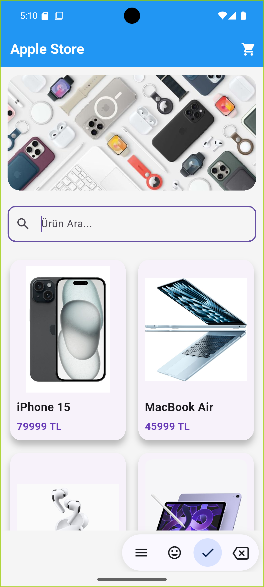
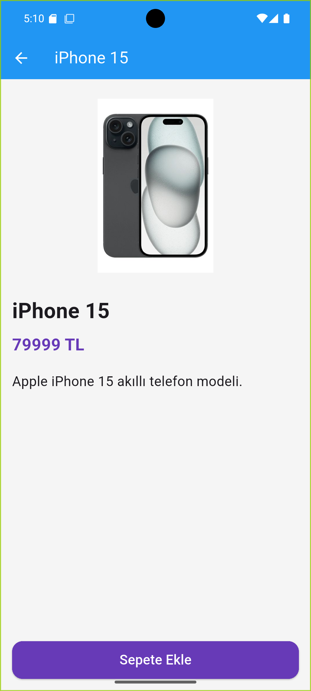
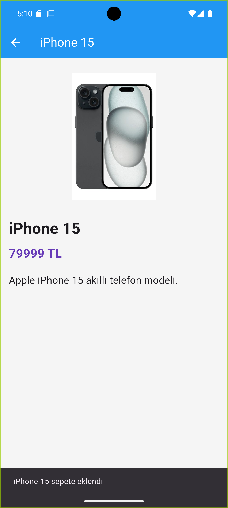
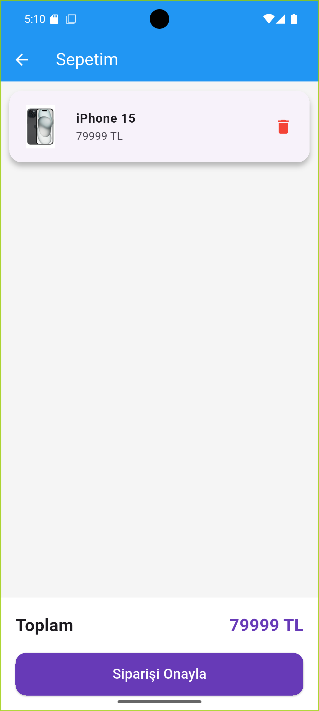
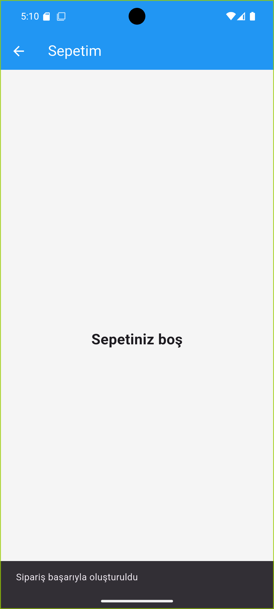

# Mini Katalog Uygulaması

Flutter ile geliştirilmiş modern görünümlü mini katalog ve alışveriş uygulaması.

## Özellikler

- Ürün listeleme
- GridView yapısı
- Ürün detay ekranı
- JSON veri kullanımı
- Navigator ile sayfa geçişi
- Ürün arama sistemi
- Gerçek ürün görselleri
- Sepet sistemi
- Sepetten ürün silme
- Toplam fiyat hesaplama
- Sipariş onaylama
- Modern UI tasarımı

## Kullanılan Teknolojiler

- Flutter
- Dart

## Proje Yapısı

```text
lib/
├── models/
├── screens/
├── services/
├── widgets/
└── data/
```

## Ekran Görüntüleri

### Ana Sayfa


### Ürün Detay Ekranı


### Ürünü Sepete Ekleme


### Sepet Ekranı


### Sipariş Onaylama


## Çalıştırma

```bash
flutter pub get
flutter run
```

## Geliştirici

Metin Kaim
