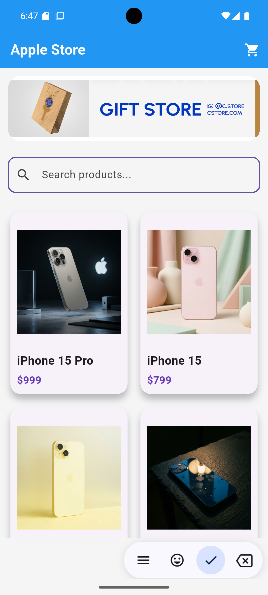
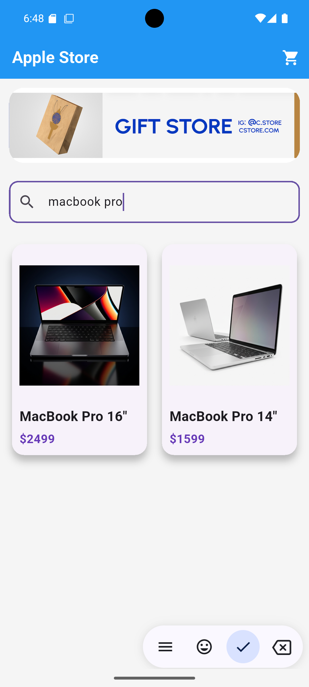
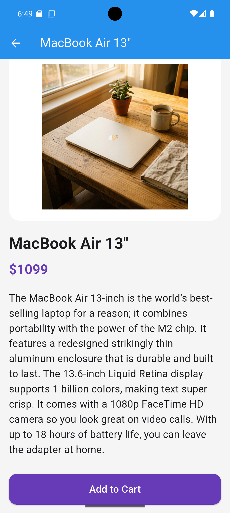
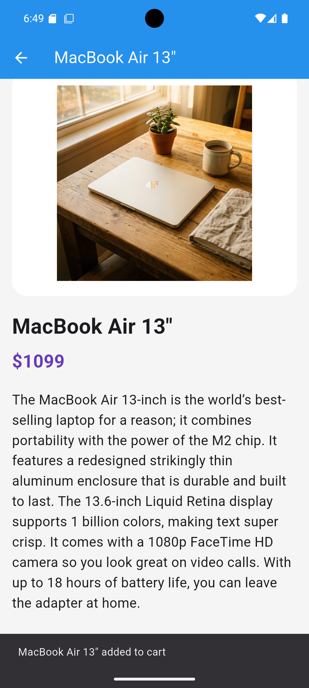
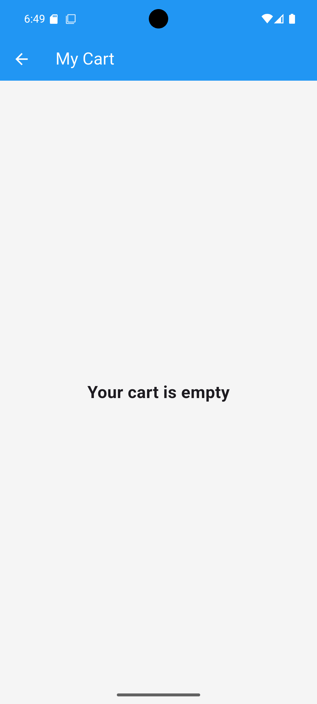
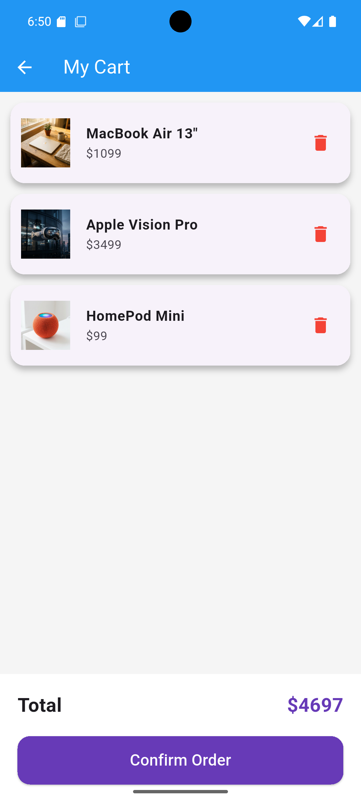
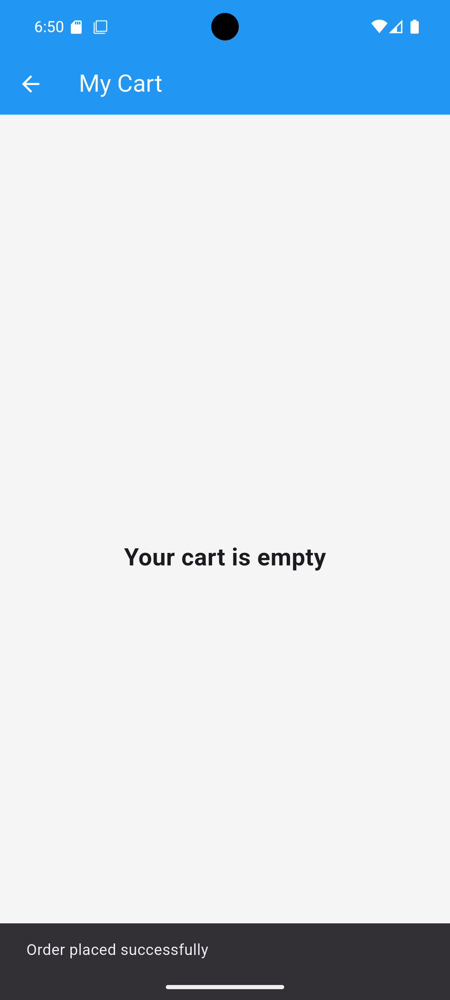

# Apple Store Katalog Uygulaması

Flutter ve Dart kullanılarak geliştirilmiş modern görünümlü katalog ve alışveriş sepeti uygulaması.

Bu proje, Flutter mobil uygulama geliştirme eğitimi kapsamında hazırlanmıştır.  
Uygulama gerçek bir mock API servisi kullanarak ürün listeleme, ürün detay sayfası, arama sistemi ve sepet işlemlerini gerçekleştirmektedir.

---

# Özellikler

- GridView ile ürün listeleme
- Ürün detay ekranı
- Ürün arama sistemi
- Sepet sistemi
- Sepete ürün ekleme
- Sepetten ürün silme
- Toplam fiyat hesaplama
- Sipariş onaylama sistemi
- REST API entegrasyonu
- Modern mobil arayüz tasarımı
- Sayfalar arası geçiş sistemi
- Snackbar bildirimleri

---

# Kullanılan Teknolojiler

- Flutter
- Dart
- REST API
- HTTP Package

---

# API

Bu projede WANTAPI mock ürün servisi kullanılmıştır:

- Ürün API  
  https://wantapi.com/products.php

- Banner Görseli  
  https://wantapi.com/assets/banner.png

---

# Proje Yapısı

```text
lib/
├── data/
├── models/
├── screens/
├── services/
├── widgets/
└── main.dart
```

---

# Ekran Görüntüleri

## Ana Sayfa
Ürünlerin GridView yapısında listelendiği ana ekran.



---

## Ürün Arama
Arama çubuğu ile ürün filtreleme sistemi.



---

## Ürün Detay Ekranı
Ürün detay bilgilerinin görüntülendiği ekran.



---

## Sepete Ürün Ekleme
Kullanıcının ürünü sepete eklediği işlem.



---

## Boş Sepet Durumu
Sepette ürün bulunmadığında görüntülenen ekran.



---

## Sepet Ekranı
Sepete eklenen ürünlerin ve toplam tutarın görüntülendiği ekran.



---

## Sipariş Onaylama
Siparişin başarıyla tamamlandığını gösteren bildirim ekranı.



---

# Kurulum

```bash
flutter pub get
flutter run
```

---

# Geliştirici

Metin Kaim