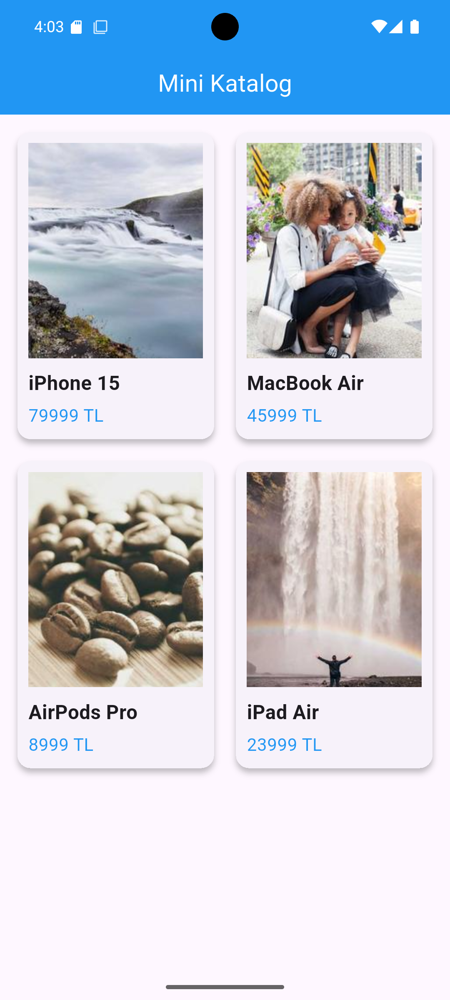

# Mini Katalog Uygulaması

Flutter ile geliştirilmiş basit katalog uygulaması.

## Özellikler

- Ürün listeleme
- GridView yapısı
- Ürün detay ekranı
- JSON veri kullanımı
- Navigator ile sayfa geçişi
- Basit sepet simülasyonu

## Kullanılan Teknolojiler

- Flutter
- Dart

## Ekran Görüntüleri

### Ana Sayfa


### Detay Sayfası


## Çalıştırma

```bash
flutter pub get
flutter run
```